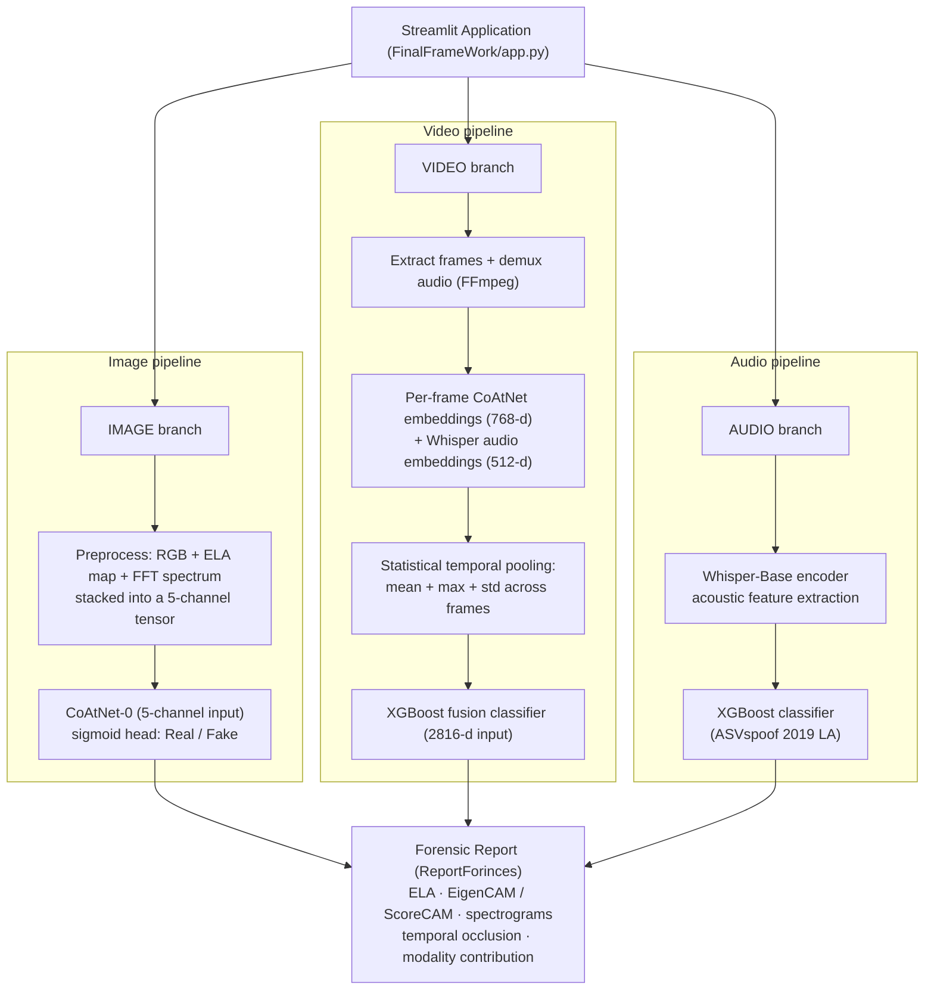

<div align="center">

# Multimodal Deepfake Detection System

### Image · Audio · Video forensics with explainable AI evidence

[](https://python.org)
[](https://pytorch.org)
[](https://streamlit.io)
[](https://xgboost.ai)
[](LICENSE)

**A production-style forensic analysis system that detects AI-generated media across three modalities — and explains *why* it flagged them.**

| Modality | Architecture | Dataset | Test AUC |
|---|---|---|---|
| **Image** | CoAtNet-0, 5-channel (RGB + ELA + FFT) | ARTIFACT — 22 generators, 130K samples | **0.9173** |
| **Audio** | Whisper-Base encoder + XGBoost | ASVspoof 2019 LA — 71K samples | **0.9886** |
| **Video** | Multimodal fusion (CoAtNet + Whisper + XGBoost) | FakeAVCeleb v1.2 — 21.5K videos | **0.9250** |

</div>

> Video AUC measured on a balanced test set (100 real / 100 fake) with an optimized decision threshold of 0.578.

---

## What Makes This System Different

Most deepfake detectors are black-box classifiers. This system is built as a **forensic tool**: every verdict ships with human-interpretable evidence — compression-inconsistency maps, activation heatmaps, spectral analyses, and per-modality contribution scores — so an analyst can audit the decision instead of trusting it blindly.

---

## System Architecture



---

## Key Technical Contributions

1. **5-Channel multi-domain input** — the image detector sees pixel space (RGB), compression space (Error Level Analysis), and frequency space (FFT) *simultaneously*, catching artifacts that any single domain misses.
2. **Transfer learning for anti-spoofing** — Whisper's ASR pre-training is repurposed as an acoustic feature extractor; an XGBoost head reaches **AUC 0.9886** with zero domain-specific neural training.
3. **Intermediate fusion** — feature-level concatenation of visual + acoustic embeddings lets the video classifier detect cross-modal desynchronization (face swap with original voice, voice clone with original face) without training an expensive end-to-end video network.
4. **Statistical temporal pooling** — mean + max + std pooling across frame embeddings explicitly encodes temporal inconsistency, a primary deepfake signature.
5. **Gradient-free interpretability** — EigenCAM and ScoreCAM produce stable activation maps for the non-standard 5-channel architecture, where gradient-based CAMs are noisy.

---

## Forensic Explainability Module (`ReportForinces/`)

| Evidence Type | Technique | What It Exposes |
|---|---|---|
| Image | Error Level Analysis (ELA) | Inconsistent re-compression from face blending/splicing |
| Image | EigenCAM / ScoreCAM | Which textures and regions triggered the detection |
| Audio | Log-mel spectrogram analysis | Unnatural spectral flatness, missing formants of TTS/VC |
| Audio | Temporal occlusion heatmaps | The exact time segments carrying spoof artifacts |
| Video | Frame-by-frame probability timeline | Localized temporal manipulations |
| Video | Modality contribution analysis | Was the verdict driven by the face or the voice? |

Full methodology: [`ReportForinces/AI_Forensic_Analysis_Report.md`](ReportForinces/AI_Forensic_Analysis_Report.md)

---

## Repository Structure

```
AI-DeepfakeDetector/
├── Audio/                     # Audio branch: training notebook (Colab T4) + docs
├── Images/                    # Image branch: training notebook (Kaggle T4) + docs
├── Video/                     # Video branch: fusion pipeline + balanced evaluation
├── FinalFrameWork/            # Streamlit app + inference modules + weights dirs
│   ├── app.py
│   ├── inference/
│   └── requirements.txt
├── ReportForinces/            # Forensic report generator + methodology docs
└── README.md
```

Per-branch deep dives: [IMAGE_BRANCH.md](Images/IMAGE_BRANCH.md) · [AUDIO_BRANCH.md](Audio/AUDIO_BRANCH.md) · [VIDEO_BRANCH.md](Video/VIDEO_BRANCH.md) · [FRAMEWORK.md](FinalFrameWork/FRAMEWORK.md)

---

## Getting Started

### 1. Prerequisites

**FFmpeg** is required for video/audio demuxing:
- Windows: download from ffmpeg.org and add to PATH
- Linux: `sudo apt-get install ffmpeg` · macOS: `brew install ffmpeg`

### 2. Setup

```bash
git clone https://github.com/YazanAi-Dev3/AI-DeepfakeDetector.git
cd AI-DeepfakeDetector/FinalFrameWork

python -m venv venv
# Windows: venv\Scripts\activate | Linux/macOS: source venv/bin/activate
pip install -r requirements.txt
```

### 3. Model Weights

Place the trained weights (produced by the three training notebooks):
- `best_coatnet_5ch.pth` → `FinalFrameWork/models/`
- `xgboost_asvspoof_model.joblib` → `FinalFrameWork/models/`
- `xgboost_fusion_model.joblib` → `FinalFrameWork/Final-Vid/`

### 4. Launch

```bash
streamlit run app.py
```

Open **http://localhost:8501**.

---

## Datasets

| Modality | Dataset | Target Manipulations |
|---|---|---|
| Image | [ARTIFACT](https://www.kaggle.com/datasets/awsaf49/artifact-dataset) | GANs & diffusion models (22 generators) |
| Audio | [ASVspoof 2019 LA](https://www.kaggle.com/datasets/awsaf49/asvpoof-2019-dataset) | TTS & voice conversion |
| Video | [FakeAVCeleb v1.2](https://www.kaggle.com/datasets/sidhanbirsingh/avceleb) | Face swaps, lip sync, cross-modal desync |

---

## License

MIT — see [LICENSE](LICENSE).
