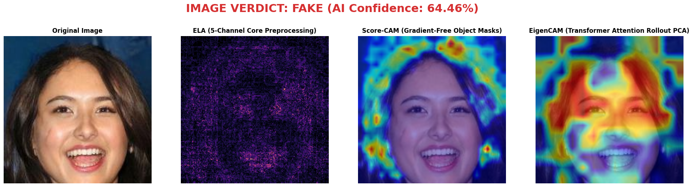
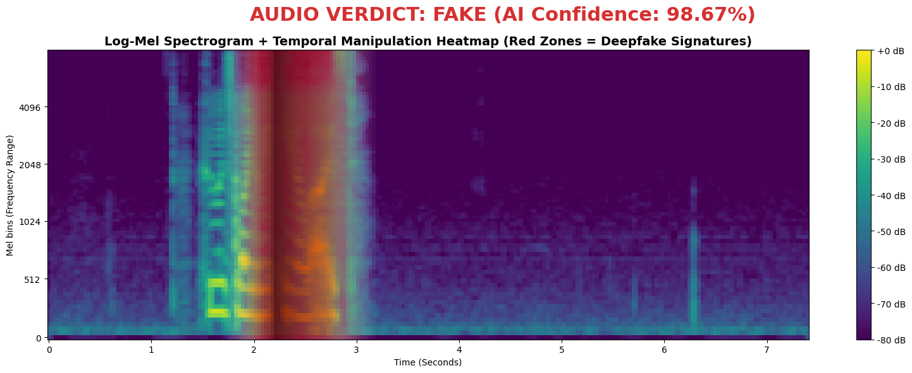
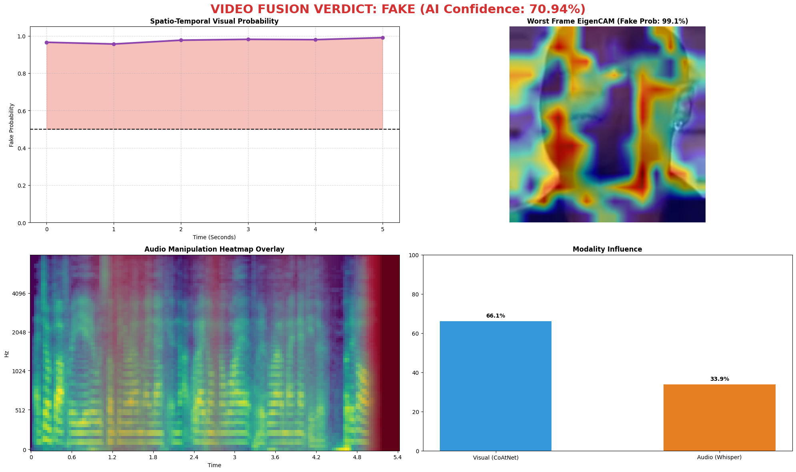

# AI Forensic Analysis Report — Documentation

## Overview

The `ReportForinces` module is an interactive Jupyter notebook designed to generate automated, AI-driven forensic analysis reports for multimedia deepfake detection. Moving beyond simple binary "Real" or "Fake" verdicts, this module acts as an explainability and transparency layer. It leverages the internal representations of the proprietary AI models trained in the Image, Audio, and Video branches (CoAtNet, Whisper, XGBoost) to produce interpretable visual proofs of manipulation.

This system provides forensic investigators and end-users with concrete, visual evidence detailing *why* a particular piece of media was flagged, isolating spatial anomalies in images and temporal discontinuities in audio or video.

---

## Files

| File | Description |
|---|---|
| `Forensic_Analysis_Report.ipynb` | Interactive forensic analysis notebook generating visual proofs. |
| `AI_Forensic_Analysis_Report.md` | This documentation detailing the methodology and sample outputs. |
| `Forensic_Reports/` | Directory where generated per-sample reports are stored. |

---

## Supported Modalities & Visual Proofs

### 1. Image Pipeline Proofs

| Technique | Description | Deepfake Signature |
|---|---|---|
| **Error Level Analysis (ELA)** | Re-compression residual map (5-channel) | Uneven ELA distribution at manipulation boundaries (e.g., facial blending). |
| **EigenCAM** | Principal component projection of CoAtNet's last conv layer | Shows which generalized image regions drive the model's classification. |
| **ScoreCAM** | Gradient-free class activation mapping | Robust activation maps highlighting precise anomalous textures without gradient noise. |

### 2. Audio Pipeline Proofs

| Technique | Description | Deepfake Signature |
|---|---|---|
| **Log-Mel Spectrogram** | Time-frequency acoustic representation used by Whisper | Synthetic TTS artifacts appear as unnatural spectral flatness or missing formants. |
| **Temporal Occlusion Heatmap** | Sequentially masks time segments and measures prediction confidence drop | Highlights the exact time segments containing severe spoofing artifacts. |

### 3. Video Pipeline Proofs

| Technique | Description | Deepfake Signature |
|---|---|---|
| **Modality Contribution Bars** | Compares visual vs. acoustic contribution to the 2816-dim XGBoost decision | Reveals whether visual (face swap) or audio (voice clone) manipulation is dominant. |
| **Spatio-Temporal Probability Timeline** | Plots per-frame spoof probability over time | Isolates the exact temporal segments where forgery was inserted. |

---

## Forensic Report Architecture

### Model Loading

```python
# All models loaded once in eval mode to prevent gradient updates during inference
image_model = CoAtNet5Channel.load("models/best_coatnet_5ch.pth")
whisper_processor = WhisperProcessor.from_pretrained("openai/whisper-base")
whisper_model = WhisperModel.from_pretrained("openai/whisper-base")
audio_xgb_model = joblib.load("models/xgboost_asvspoof_model.joblib")
video_fusion_xgb = joblib.load("Final-Vid/xgboost_fusion_model.joblib")
```

### Report Generation

For each media sample analyzed, a dedicated report directory is created containing high-resolution visual proofs:

```text
Forensic_Reports/
|-- {sample_filename}/
    |-- ela_map.png             # ELA visualization
    |-- eigen_cam.png           # EigenCAM overlay
    |-- score_cam.png           # ScoreCAM overlay
    |-- mel_spectrogram.png     # Log-Mel spectrogram
    |-- occlusion_heatmap.png   # Temporal occlusion analysis
    |-- modality_bars.png       # Contribution analysis
    |-- probability_timeline.png# Per-frame spoof probability
    |-- report_summary.json     # Machine-readable report summary
```

---

## Image Forensic Pipeline

### Step 1: ELA Map Generation

```python
ela_map = compute_ela(image_rgb, quality=90)
```

**Interpretation:**
- Uniform low ELA indicates a consistent compression history typical of authentic, unedited photographs.
- Concentrated high ELA regions indicate inconsistent re-compression, serving as a primary signal for localized image manipulation.

### Step 2: EigenCAM Visualization

```python
from pytorch_grad_cam import EigenCAM
cam = EigenCAM(model=image_model, target_layers=[image_model.stages[-1]])
grayscale_cam = cam(input_tensor=tensor_5ch)
visualization = show_cam_on_image(rgb_norm, grayscale_cam[0])
```

EigenCAM utilizes the principal components of the feature maps rather than backpropagating gradients. This makes it exceptionally stable for complex, multi-channel architectures like our 5-channel CoAtNet.



### Step 3: ScoreCAM Visualization

```python
from pytorch_grad_cam import ScoreCAM
cam = ScoreCAM(model=image_model, target_layers=[image_model.stages[-1]])
visualization = cam(input_tensor=tensor_5ch)
```

ScoreCAM is a gradient-free approach that upscales and scores activation maps based strictly on their effect on the final classification confidence, producing smooth, highly reliable saliency maps.

---

## Audio Forensic Pipeline

### Step 1: Log-Mel Spectrogram

```python
S = librosa.feature.melspectrogram(y=audio, sr=16000, n_mels=128)
S_dB = librosa.power_to_db(S, ref=np.max)
librosa.display.specshow(S_dB, x_axis='time', y_axis='mel')
```

**Interpretation:**
- Natural speech exhibits smooth frequency transitions with complex, organic formant structures.
- TTS and Voice Conversion audio frequently display unnatural spectral flatness, periodic repetitive artifacts, or stark temporal discontinuities in the high-frequency bands.

### Step 2: Temporal Occlusion Heatmap

```python
# Mask 0.5s windows sequentially, measure confidence drop
for t in range(0, total_frames, stride):
    occluded = audio.copy()
    occluded[t:t+window] = 0  # Zero-out segment
    embedding = whisper_encoder(occluded)
    spoof_prob = xgb_classifier.predict_proba(embedding)
    sensitivity[t] = original_prob - spoof_prob
```

High sensitivity at time `t` indicates that muting that specific segment drastically lowers the deepfake confidence, implying that segment contains the critical deepfake acoustic evidence.



---

## Video Forensic Pipeline

### Step 1: Modality Contribution Analysis

```python
# Visual contribution: CoAtNet embedding magnitude
visual_vec = statistical_pool(frame_embeddings)  # (2304,)
visual_contribution = np.abs(visual_vec).mean()

# Audio contribution: Whisper embedding magnitude  
audio_contribution = np.abs(audio_embedding).mean()

# Normalized contribution bars
total = visual_contribution + audio_contribution
visual_pct = visual_contribution / total * 100
audio_pct = audio_contribution / total * 100
```

**Interpretation:**
- High visual contribution points toward a face swap or visual manipulation with authentic audio.
- High audio contribution points toward a voice cloning or lip-sync attack.
- Balanced contribution indicates that both modalities are manipulated.

### Step 2: Spatio-Temporal Probability Timeline

```python
frame_probs = []
for frame in all_video_frames:
    embedding = coatnet.extract_features(frame)  # (768,)
    # Classify each frame independently with audio context
    fused = concat([embedding, audio_embedding])
    prob = video_xgb.predict_proba(fused)[0, 1]
    frame_probs.append(prob)

plt.plot(timestamps, frame_probs)
plt.axhline(y=0.5780, color='red', linestyle='--', label='Decision Threshold')
```

**Interpretation:**
- Probability spikes at specific timestamps pinpoint the exact moments a forgery was inserted.
- A uniformly high probability suggests the entire video sequence is manipulated.



---

## Methodological Notes

### Why Gradient-Free CAM?

Standard GradCAM requires gradient computation backward through the target layer. For our 5-channel CoAtNet, the additional ELA and FFT channels introduce significant gradient noise when attempting to compute spatial attributions corresponding to the RGB channels. EigenCAM and ScoreCAM bypass this limitation entirely by working directly with feature map activations, thereby producing much cleaner and more interpretable forensic visualizations.

### Why Temporal Occlusion for Audio?

The Whisper encoder processes the entire audio sequence holistically. While this yields an excellent global embedding, it makes it difficult to localize *when* the spoofing occurs within a clip. Temporal occlusion analytically tests each time window's specific contribution to the overall spoof probability, effectively decomposing the classifier's global decision into a highly time-resolved sensitivity map.

### Why Modality Contribution Analysis for Video?

The 2816-dim XGBoost fusion classifier operates on concatenated visual (2304-dim) and acoustic (512-dim) features. By separately analyzing the activation magnitudes of each modality sub-vector during inference, we can directly attribute the classification decision to its visual versus acoustic drivers. This provides actionable forensic intelligence about the precise nature of the video manipulation.

---

## Technical Stack

| Component | Library/Version |
|---|---|
| Gradient-Free CAM | `pytorch-grad-cam` (EigenCAM, ScoreCAM) |
| Audio Visualization | `librosa` |
| Deep Learning | `PyTorch` |
| Image Processing | `OpenCV`, `Pillow` |
| Report Formatting | `matplotlib`, `seaborn` |
| Data Serialization | `json` |
