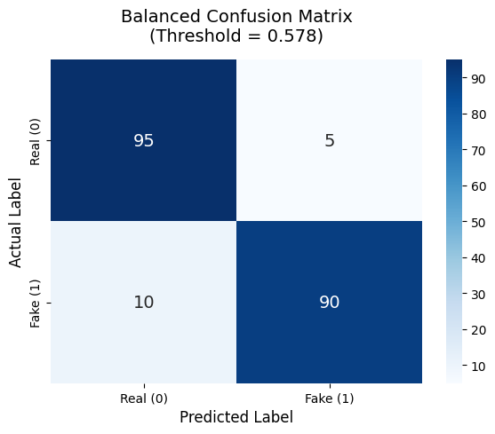
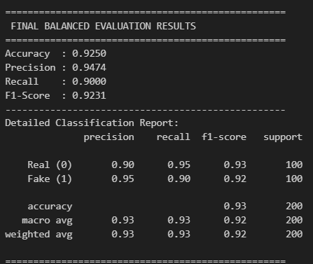

# Video Deepfake Detection Branch

## Overview

This branch implements a multimodal video deepfake detection system via intermediate feature-level fusion. Rather than training a new massive neural network end-to-end—which is computationally expensive and prone to overfitting—this architecture leverages the pre-trained visual and acoustic encoders from the Image and Audio branches as frozen feature extractors. A lightweight XGBoost fusion classifier is then trained on the concatenated multimodal representation.

The system detects deepfakes by simultaneously analyzing both visual frame artifacts (via CoAtNet) and audio spoofing signatures (via Whisper). This dual-modality approach makes it robust against a wide range of sophisticated manipulation types, including face swaps, lip-sync deepfakes, voice cloning, and audio-visual desynchronization attacks.

---

## Notebooks

- **`FakeAVCeleb_Fusion_Pipeline.ipynb`**: Full pipeline containing dataset parsing, feature extraction, XGBoost training, threshold tuning, and comprehensive evaluation.
- **`FakeAVCeleb_Balanced_Test.ipynb`**: Balanced test set evaluation (100 Real vs 100 Fake) to identify the optimal operating threshold `0.5780`.

---

## Dataset

| Property | Value |
|---|---|
| **Name** | FakeAVCeleb v1.2 |
| **Source** | Kaggle |
| **Kaggle Link** | `[DATASET_LINK_PLACEHOLDER]` |
| **Format** | MP4 video files |
| **Total Videos** | 21,566 |
| **Celebrities** | Real celebrity video sources |

### Dataset Statistics

| Type | Count | Label |
|---|---|---|
| **RealVideo-RealAudio** | 500 | 0 (Bonafide) |
| **FakeVideo-FakeAudio** | 10,857 | 1 (Spoof) |
| **FakeVideo-RealAudio** | 9,709 | 1 (Spoof) |
| **RealVideo-FakeAudio** | 500 | 1 (Spoof) |

### Manipulation Methods Distribution

| Method | Videos |
|---|---|
| `wav2lip` | 9,602 |
| `fsgan` | 3,964 |
| `fsgan-wav2lip` | 3,553 |
| `faceswap-wav2lip` | 2,717 |
| `faceswap` | 730 |
| `rtvc` | 500 |

### Demographic Diversity

| Race | Gender |
|---|---|
| Caucasian (American): 4,864 | Men: 11,107 |
| Caucasian (European): 4,693 | Women: 10,459 |
| Asian (South): 4,414 | |
| African: 4,097 | |
| Asian (East): 3,498 | |

### Train/Test Split

| Split | Total | Bonafide | Spoof |
|---|---|---|---|
| **Train** | 17,252 | 400 | 16,852 |
| **Test** | 4,314 | 100 | 4,214 |

**Labeling Logic:** Only `RealVideo-RealAudio` is labeled Bonafide (0). All other types — including `RealVideo-FakeAudio` (audio-only attack) — are labeled Spoof (1). This strict definition ensures the system learns to catch all manipulation scenarios, penalizing any unauthentic modality.

---

## Model Architecture: Intermediate Fusion Pipeline

### Pipeline Overview

```text
         Video File
            |
    +-------+----------+
    |                  |
 5 Frames          Audio Track
 (FFmpeg)          (FFmpeg demux)
    |                  |
  CoAtNet           Whisper-Base
  5-Channel          Encoder
  Frozen             Frozen
    |                  |
 5 x 768-dim       512-dim
 Frame Embeddings  Audio Embedding
    |                  |
 Statistical       Mean Pooling
 Pooling           (already done)
    |                  |
 2304-dim          512-dim
    +-------+----------+
            |
     Concatenation
            |
         2816-dim
     Fused Feature Vector
            |
       XGBoost
       Classifier
            |
  [Real / Fake] + Confidence
```

### Dimension Summary

| Component | Dimensions | Description |
|---|---|---|
| CoAtNet embedding (per frame) | 768-dim | Penultimate layer features capturing spatial and frequency anomalies |
| Frame embeddings (5 frames) | 5 x 768 | Temporal sequence representation |
| Statistical pooling: mean | 768-dim | Average frame representation over time |
| Statistical pooling: max | 768-dim | Peak activation per feature, identifying extreme artifacts |
| Statistical pooling: std | 768-dim | Temporal variation per feature |
| **Video vector** | **2304-dim** | Mean + Max + Std |
| Whisper audio embedding | 512-dim | Mean-pooled encoder output capturing phonetic and acoustic signatures |
| **Fused vector** | **2816-dim** | Visual + Acoustic unified representation |

### Frame Sampling Strategy

```python
NUM_FRAMES = 5           # Uniform sampling from temporal axis
MAX_FRAMES = 300         # Cap to avoid memory issues
BLACK_THRESHOLD = 5      # Ignore near-black frames (mean pixel value)
FRAME_SIZE = (224, 224)  # Resize to CoAtNet input
```

**Frame Padding:** If fewer than `NUM_FRAMES` valid frames are found, the first frame is replicated. This mirrors the training procedure and guarantees consistent tensor dimensions for the XGBoost classifier.

### Statistical Pooling (Visual Branch)

Rather than using a single frame or simple temporal mean, we compute mean, max, and standard deviation across the 5 frame embeddings:

```python
feat_mean = frame_embeddings.mean(axis=0)   # (768,) — Average appearance
feat_max  = frame_embeddings.max(axis=0)    # (768,) — Peak artifacts
feat_std  = frame_embeddings.std(axis=0)    # (768,) — Temporal inconsistency
video_vector = np.concatenate([feat_mean, feat_max, feat_std])  # (2304,)
```

- **Mean:** Captures the "average" deepfake signature across the video.
- **Max:** Highlights the single most suspicious frame's artifacts, ensuring that short-duration glitches are not smoothed out.
- **Std:** Reveals temporal inconsistency. Real faces have natural motion variation, while generated frames may have suspiciously uniform embeddings or jittery inconsistencies.

### Audio Extraction

```python
cmd = ["ffmpeg", "-i", video_path, "-t", "30",   # Max 30s (same as training)
       "-vn", "-acodec", "pcm_s16le", "-ar", "16000", "-ac", "1", tmp_wav]
```

**Fallback for silent/missing audio:** If audio extraction fails (e.g., silent video or corrupted audio track), the audio vector is zero-padded: `audio_vector = np.zeros(512)`. This graceful degradation ensures the visual features are still utilized for classification rather than failing the entire pipeline.

### XGBoost Fusion Classifier

| Parameter | Value |
|---|---|
| **Algorithm** | XGBoost |
| **Input Dim** | 2816 |
| **Task** | Binary classification |
| **Optimal Threshold** | **0.5780** (tuned on balanced eval) |

---

## Training Methodology

### Phase 1: Offline Feature Extraction (Frozen Encoders)

Both CoAtNet (visual) and Whisper (audio) are loaded in **eval mode with no gradient tracking**:
- CoAtNet weights from the Image Branch (`best_coatnet_5ch.pth`).
- Whisper `openai/whisper-base` from HuggingFace.

For each of the 17,252 training videos:
1. Extract 5 uniform frames.
2. Compute ELA + FFT maps per frame.
3. Run through frozen CoAtNet to extract 768-dim embeddings.
4. Apply statistical pooling to generate a 2304-dim video vector.
5. FFmpeg demux audio and feed to Whisper encoder to extract a 512-dim audio embedding.
6. Concatenate vectors into a 2816-dim fused feature matrix.

### Phase 2: XGBoost Training on Fused Features

```text
Train: 17,252 videos | Test: 4,314 videos
Feature matrix: X = (17252 x 2816)
```

### Phase 3: Threshold Optimization

The default 0.5 threshold was explicitly calibrated on a balanced evaluation set (100 Real, 100 Fake) to find the optimal operating point:

```text
Optimal Threshold = 0.5780
```

This threshold was mathematically derived to maximize the balanced accuracy between false positive and false negative rates, counteracting the severe class imbalance present in the original training set.

---

## Results & Evaluation

### Balanced Test Set (200 videos — 100 Real, 100 Fake)

*Evaluated with optimal threshold `0.5780`*

| Metric | Value |
|---|---|
| **Accuracy** | **0.9250** |
| **Precision** | **0.9474** |
| **Recall** | **0.9000** |
| **F1-Score** | **0.9231** |

#### Per-Class Performance

| Class | Precision | Recall | F1-Score | Support |
|---|---|---|---|---|
| **Real (0)** | 0.90 | 0.95 | 0.93 | 100 |
| **Fake (1)** | 0.95 | 0.90 | 0.92 | 100 |
| **Macro Avg** | 0.93 | 0.93 | 0.92 | 200 |

### Visual Demonstrations

The system's high discriminatory power is illustrated through the balanced confusion matrix:



```text
                 Predicted Real    Predicted Fake
Actual Real:          95               5
Actual Fake:          10              90
```

*Threshold = 0.5780 | 95% Real accuracy | 90% Fake accuracy*



*(Above: Output detailing the fusion classifier's metrics during the balanced test run)*

---

## Key Strengths & Design Decisions

1. **Intermediate Fusion (Not Late Fusion):** Concatenating embeddings before the classifier allows XGBoost to learn complex cross-modal interactions. For example, the tree can learn conditions where the audio is entirely real but the visual artifacts are highly suspicious, or vice versa, which simple probability averaging (late fusion) cannot capture.
2. **Zero Additional Neural Training:** Both deep neural networks (CoAtNet and Whisper) are entirely frozen. Only a highly optimized, lightweight XGBoost model is trained, reducing required GPU hours from days to a matter of minutes.
3. **Memory-Efficient Shared Encoders:** In the final Streamlit application, `VideoDeepfakeDetector` borrows the `ImageDeepfakeDetector` and `AudioDeepfakeDetector` instances already loaded in memory. This eliminates duplicate model instantiation and keeps the VRAM footprint low.
4. **Statistical Pooling Captures Temporal Dynamics:** Using mean + max + std instead of just a simple mean explicitly encodes how much the video changes over time, which serves as a potent signal. AI-generated videos frequently lack natural temporal variation, exhibiting either rigidity or severe jitter.
5. **Robust Audio Fallback:** By zero-padding the audio vector when audio extraction fails (due to silent videos or corrupted tracks), the system gracefully continues inference. This guarantees visual analysis is never aborted.
6. **Calibrated Decision Threshold:** The custom threshold `0.5780` was optimized strictly on a balanced test set. This completely prevents the inherently biased behavior that a default `0.5` boundary produces when trained on heavily imbalanced datasets like FakeAVCeleb.
7. **Diverse Manipulation Coverage:** FakeAVCeleb includes an extensive array of attack methods (wav2lip, fsgan, faceswap, voice conversion), ensuring strict cross-method generalization capability.

---

## Inference Integration

```python
class VideoDeepfakeDetector:
    def __init__(self, xgb_path="Final-Vid/xgboost_fusion_model.joblib"):
        self.classifier = joblib.load(xgb_path)

    def predict(self, video_path, image_model, audio_model):
        # 1. Extract 5 uniform frames from video
        frames = extract_frames_from_video(video_path, num_frames=5)

        # 2. Visual features via shared CoAtNet
        frame_embeddings = [image_model.extract_features(f) for f in frames]
        video_vector = concat([mean, max, std])  # (2304,)

        # 3. Audio features via shared Whisper
        tmp_wav = extract_audio_from_video(video_path)
        audio_vector = audio_model.extract_features(tmp_wav)  # (512,)

        # 4. Fuse and classify
        fused = concat([video_vector, audio_vector])  # (2816,)
        spoof_prob = classifier.predict_proba(fused)[0, 1]

        # 5. Apply optimal threshold
        if spoof_prob >= 0.5780:
            return "Fake (Deepfake Detected)", spoof_prob
        else:
            return "Real (Authentic Video)", 1 - spoof_prob
```

---

## Technical Stack

| Component | Library/Version |
|---|---|
| Video Frame Extraction | `OpenCV` |
| Audio Demuxing | `FFmpeg` (system dependency) |
| Visual Feature Extraction | CoAtNet-0 (`timm`) |
| Audio Feature Extraction | `openai/whisper-base` (HuggingFace) |
| Fusion Classifier | `XGBoost` |
| Model Serialization | `joblib` |
| Training Platform | Google Colab (Tesla T4 GPU) |
