# HNX26PSI10 — Multimodal Deepfake & Digital Forensics
### Final Architecture, Pipeline, Requirements & Datasets
*Synthesized from 42 research papers — see [`../papers/`](../papers/) for the full annotated index.*

---




---

## 1. System Overview

Input: image, video, and/or audio. Output:
- **Authenticity label** using a 4-way scheme (not plain binary): **RVRA** (real video + real audio), **RVFA** (real video + fake/cloned audio), **FVRA** (fake/manipulated video + real audio), **FVFA** (fake video + fake audio). This maps directly onto the PS's "what might be fake" list and tells you *which* modality was attacked, not just real-vs-fake.
- **Calibrated confidence score** (e.g. "80% likely real") — genuinely calibrated via temperature/isotonic scaling, not a raw softmax number.
- **Localization** — spatial region (image/video) and/or time interval (audio/video) of the suspected manipulation.
- **Natural-language explanation** citing the specific signals that drove the decision.
- **Abstention flag** when confidence sits near the decision boundary or the input resembles a generator family outside training distribution — report "uncertain," not a confident wrong answer.

Two existing systems are near-exact blueprints for this contract: **Omni-Fake-R1** (CVPR 2026, unified 4-modality model outputting label + bbox/interval + explanation) and **SIDA** (CVPR 2025, its single-image ancestor: detection→localization→explanation via cross-attention). Build a lighter-weight version of the same pattern — full MLLM fine-tuning is a stretch goal, not an MVP requirement.

---

## 2. Architecture

### 2.1 Visual branch (image/video)
Face detect + align (RetinaFace / MediaPipe) → three parallel sub-branches, concatenated:
- **Spatial/texture**: EfficientNet or ViT backbone — blending-boundary and texture artifacts, mask-boundary "haloing" (named failure mode of face-swap compositing).
- **Frequency**: DCT/FFT spectral branch — GAN checkerboard fingerprints **and** diffusion denoising signatures. These are *different* artifact families (confirmed across multiple generation papers) — don't assume one branch catches both.
- **Geometry/pose**: MediaPipe Face Mesh + pose estimation — newer face-swappers (e.g. AlphaFace, FaceChanger-class models) specifically target high-yaw angles (>60°) where older detectors are weakest; pose-conditioned boundary consistency catches this.

Video adds a **temporal** sub-branch (3D-CNN or CNN+Transformer over frame sequence) for blink/micro-expression irregularity.

Output: Grad-CAM/attention heatmap → bbox or segmentation mask localization.

### 2.2 Audio branch
- **Primary — raw-waveform end-to-end model**: RawNet2-style, or SSL front-end (XLS-R-300M / HuBERT) + AASIST2 graph-attention backend, LoRA-adapted. Evidence-based choice: a head-to-head comparison found a spectrogram/ViT-based model collapsing to ~51% (random) against commercial clones (ElevenLabs/RVC) while the raw-waveform model stayed far more stable — spectrogram-only models overfit to semantic/phonetic shortcuts, not the actual synthesis artifact.
- **Secondary — spectral-artifact branch**: phase-coherence / harmonic-aliasing detector. GAN vocoders (HiFi-GAN/BigVGAN lineage) leave characteristic upsampling-aliasing harmonics; codec-LM clones (VALL-E/CosyVoice-class) leave a *different* RVQ-token artifact family; flow-matching TTS (an emerging third generation paradigm, confirmed in a 2026 dubbing paper) will need its own artifact study. Cover multiple families — don't assume a single detector generalizes across all three.

Output: per-utterance confidence + flagged time intervals (temporal localization).

### 2.3 Cross-modal consistency branch
- **SyncNet-based LSE-C / LSE-D** (lip-sync error confidence/distance) — the standard, widely-used metric.
- **Phoneme-viseme mismatch check**: sounds like "M/B/P" require full lip closure; deepfake lip generators frequently fail to reproduce this precisely. Cheap, rule-based, and easy to explain to a judge — a good complement to the opaque SyncNet score.
- **Critical caveat (quantified)**: a 2026 dubbing paper reports synthetic output with LSE-C of **8.36 — beating its own ground-truth audio's 7.33**. A tuned fake can out-score real video on naive sync metrics. Treat LSE-C/D as one fused signal, never a standalone gate.
- Optional: AV-HuBERT or cross-attention AV embedding alignment for deeper intra/inter-modal disharmony detection beyond lip-timing alone (avoids needing a Wav2Lip-style synthetic-lip intermediate step).

### 2.4 Fusion & scoring
- Cross-attention transformer: project all branch outputs into a shared latent space, feed as tokens, fuse into one embedding → classifier head.
- **Dynamically-weighted fusion gate** (not naive concatenation): multiple published feature-fusion systems were found to be "visually dominant," with audio contributing minimally to the final score. Calibrate each modality's contribution by its own confidence/consistency (AVT2-DWF-style) so audio signal doesn't get drowned out.
- Keep a **per-modality confidence score** alongside the global one — the single biggest interpretability win across the fusion-architecture papers (one ablation showed fusion lifting accuracy from a ~70% unimodal cap to 85%+ fused, while retaining which-modality-was-suspicious detail).
- **Calibrate** the final probability (temperature scaling / isotonic regression on a held-out set) — most published systems report only hard labels, not genuinely calibrated probabilities, which is exactly what "80% likely real" requires.
- **Abstention band**: near-boundary or out-of-distribution-generator inputs get flagged "uncertain" rather than forced into a confident wrong call.
- **Graceful degradation for missing modalities**: build the fusion layer to fall back to single-modality confidence when only image or only audio is submitted — the PS's "if both present" phrasing implies both won't always be available.

### 2.5 Localization
- Visual: Grad-CAM/attention heatmap → bbox, or segmentation mask (SIDA-style) as a stretch goal.
- Audio: suspicious time-interval flagging from the spectral/raw-waveform branch's frame-level anomaly scores.
- Cross-modal: **Modality Dissonance Score (MDS)**-style localization — flags *which video segments* show audio-visual dissonance, cheaper to implement than full pixel-level masks and a good MVP localization method.

### 2.6 Explanation layer
Structured evidence object → template-filled or LLM-prompted natural language:
```
{
  per_modality_confidence: {...},
  top_signals: ["mouth-boundary blending detected",
                 "spectral aliasing consistent with GAN vocoder",
                 "lip-sync error 3.2σ above threshold",
                 "phoneme /m/ at 00:12 lacks lip closure"],
  localization: { bbox / mask / time_interval }
}
```
This is the proven, lightweight pattern (used in a 96–99%-accuracy unified explainable detector) — no MLLM fine-tuning required for an MVP. Full vision-language joint explanation generation (SIDA/Omni-Fake-style) is a stretch goal only.

---

## 3. Pipeline (build order)

1. **Visual-only MVP**: spatial + frequency branch on FaceForensics++ → single-modality score + Grad-CAM heatmap.
2. **Audio branch**: SSL-backbone classifier on ASVspoof2019, raw-waveform preferred. Immediately test on an OOD set (WaveFake / In-the-Wild) to *demonstrate* generalization — don't just assume it.
3. **Cross-modal**: add SyncNet LSE-C/D + phoneme-viseme check when both modalities present; combine via simple late-fusion (logistic regression) first.
4. **Explanation + calibration**: structured evidence → templated/LLM explanation; temperature-scale the score.
5. **Stretch**: learned cross-attention fusion with dynamic weighting; segmentation-mask localization; explicit compression/crop/re-encode robustness testing; diffusion-based denoising preprocessor for noisy/compressed inputs (shown to give consistent 2–5pt gains in one fusion paper); missing-modality graceful degradation.

### Robustness test matrix (explicit, from the survey literature)
Test against: non-frontal/occluded faces, far-from-camera faces, multiple speakers, background clutter, multiple camera angles, environmental noise, JPEG/resize compression, re-encoding. This is your checklist for the "handle compressed/cropped/re-encoded" judging criterion — and it's exactly where published models are documented to degrade.

---

## 4. Generalization tactics (hardest judging criterion — concrete, paper-backed moves)

- **SSL/foundation features** (XLS-R/HuBERT, CLIP/ViT) over handcrafted features — repeatedly shown to generalize better OOD.
- **Self-blending-style synthetic augmentation** rather than training only on known real/fake pairs.
- **Your own disjoint train/OOD-test split** — one survey's own benchmark showed detectors going from ~100% AUC (UADFV/FF++) to <60% AUC (Celeb-DF) with the *same model*. That collapse is exactly what judges will be probing for; report it explicitly rather than hiding behind in-distribution numbers.
- **Random JPEG/resize/noise augmentation** during training for compression robustness.
- **Abstention on out-of-family generators** (e.g. commercial black-box TTS like ElevenLabs) rather than forcing a confident call — a quantified collapse case (ViT-MFCC model: 78–85% on open-source clones → ~51% random on ElevenLabs/RVC) is exactly the failure mode to guard against.

---

## 5. Datasets

**Image/video**: FaceForensics++, Celeb-DF(v2), DFDC (full + preview), DeeperForensics-1.0, WildDeepfake, ForgeryNet (largest/most diverse, 15 manipulation methods), KoDF, DF-TIMIT, OpenForensics, DeepFakeFace/DFF (diffusion-generated — needed for wholly-synthetic-face coverage, since GAN-only training won't catch diffusion fakes)

**Audio**: ASVspoof 2019 & 2021 (LA/DF), WaveFake, In-the-Wild (OOD benchmark), FoR, ADD2022/2023 challenge sets, CFAD

**Multimodal/AV**: FakeAVCeleb, AV-Deepfake1M (large-scale, has temporal localization labels), LAV-DF, TVIL, **PolyGlotFake** (7 languages, ~15K videos — plugs the English-centric bias flagged across multiple surveys; include this if your demo needs to handle non-English audio)

**Recommended OOD split**: train on FF++ / DFDC / ASVspoof2019 → test generalization on Celeb-DF + In-the-Wild + WaveFake + any commercial TTS samples you can get. This mirrors how the strongest reference systems measured real generalization, not just in-distribution accuracy.

---

## 6. Requirements / Stack

- **Visual**: PyTorch + `timm` (EfficientNet/ViT), MediaPipe, OpenCV, RetinaFace/facenet-pytorch
- **Audio**: `torchaudio`, HuggingFace `transformers` (Wav2Vec2/XLS-R/HuBERT checkpoints), AASIST reference repo, `librosa`
- **Cross-modal**: pretrained SyncNet (from the Wav2Lip repo)
- **Fusion**: small PyTorch transformer encoder, or XGBoost/sklearn on extracted embeddings for faster iteration
- **Calibration**: sklearn (Platt/isotonic) or torch temperature scaling
- **Explanation**: any LLM API with a structured-evidence prompt, or a rule-based template engine for the fastest MVP
- **Demo/serving**: FastAPI backend + Gradio or Streamlit frontend
- **Compute**: all backbones here (EfficientNet, XLS-R-300M, ViT-base) run inference on a single consumer GPU (8–12GB VRAM); use LoRA for any fine-tuning to keep training cheap (<1% trainable params, per the reference audio paper)
- **Efficiency note**: for any real-time/scale deployment beyond the hackathon demo, pruning/quantization/knowledge-distillation is the documented path — worth a line in your write-up even if not implemented for the demo itself

---

## 7. Positioning notes for judging/pitch

- Almost none of the 42 papers surveyed deeply cover **lip-sync-mismatch + voice-cloning together** as a joint detection target — underexplored territory you can position against directly (one position paper found 71% of deepfake-detection research targets public-figure face-swap video while voice-clone/real-world-distribution cases are comparatively starved of attention).
- Humans score only ~64–66% accuracy on AV deepfake detection vs. 75–97% for AI models in published benchmarks (though those AI numbers are in-distribution, not OOD) — useful, citable framing for why automated authenticity scoring matters.
- Your strongest differentiator vs. naive sync-score-only systems: explicitly flagging that **LSE-C/D can be gamed** (one dubbing paper's synthetic output beat its own ground truth's sync score) and designing fusion to never rely on it alone.
